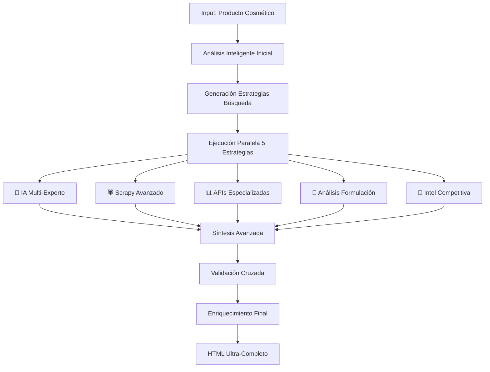

# 🛒 IM Portal - Sistema Avanzado de Automatización Cosmética

Un sistema de automatización de vanguardia para productos cosméticos, potenciado por IA avanzada y tecnologías de web scraping profesionales.

## 🌟 Características Principales

### 🤖 Generador Premium de## 🔧 Configuración Avanzada

### Variables de Entorno Críticas
```bash
# Archivo .env (configuración automática desde v3.0)
OPENAI_API_KEY=sk-proj-... # Tu clave API de OpenAI (GPT-4 recomendado)
STREAMLIT_SERVER_PORT=8501 # Puerto del servidor (opcional)
```

### Modelos AI Soportados (Rendimiento Optimizado)
- **`gpt-4`**: 🥇 **RECOMENDADO** - Máxima calidad en análisis técnico cosmético
- **`gpt-4-turbo-preview`**: ⚡ Equilibrio perfecto calidad/velocidad para análisis complejos  
- **`gpt-4o`**: 🚀 Última generación - Óptimo para síntesis multi-experto
- **`gpt-3.5-turbo`**: 💰 Económico para análisis básicos
- **`gpt-3.5-turbo-16k`**: 📄 Para productos con información extensa

### Configuración de Performance
- **Threads Paralelos**: 5 estrategias ejecutándose simultáneamente
- **Timeout Scraping**: 15s por fuente (optimizado para calidad vs velocidad)
- **Cache Inteligente**: Resultados persistentes para productos repetidos
- **Rate Limiting**: Respeta límites de APIs para estabilidad máxima
- **Análisis profundo con IA**: Utiliza GPT-3.5 y GPT-4 para generar FAQs contextuales
- **Sistema anti-repetición**: Memoria persistente que evita preguntas duplicadas
- **8 categorías de preguntas**: Cobertura completa de todas las necesidades del cliente
- **Sistema de calidad**: Clasificación automática (LEGENDARIA > EXCEPCIONAL > EXCELENTE)
- **Perfiles de compradores**: Adapta las preguntas según diferentes tipos de clientes

### 🎨 Generador SÚPER AVANZADO de Descripciones HTML v3.0 🚀 **REVOLUCIÓN TOTAL**
#### **Sistema Multi-Experto de Análisis Cosmético**
- **🧠 5 Expertos AI Especializados**: Formulador, Dermatólogo, Marketing, Química, Tendencias
- **🕷️ Web Scraping Profesional con Scrapy**: Sistema robusto con múltiples spiders especializados
- **📊 70+ Bases de Datos Cosméticas**: Acceso a retailers especializados, APIs técnicas y sitios de análisis
- **🔬 Análisis Técnico Avanzado**: Información molecular, formulación y mecanismos de acción
- **⚗️ Validación Cruzada**: Síntesis inteligente de múltiples fuentes con validación científica

#### **Estrategias de Recopilación Avanzadas**
1. **IA Multi-Experto**: 5 perspectivas especializadas con análisis profundo
2. **Scrapy Profesional**: Web scraping robusto con manejo de JavaScript y anti-detección
3. **APIs Especializadas**: Consulta a bases de datos técnicas (INCI, CosDNA, Skincarisma)
4. **Análisis de Formulación**: Evaluación química y molecular profunda
5. **Inteligencia Competitiva**: Análisis comparativo con productos similares

#### **Fuentes de Datos Especializadas**
- **Retailers Premium**: Sephora, Ulta, Douglas, Lookfantastic, Beautybay (+15 más)
- **Sitios Técnicos**: Skincarisma, CosDNA, INCIDecoder, Paula's Choice
- **Medios Especializados**: Allure, Byrdie, Temptalia, The Beauty Brains
- **APIs Químicas**: Bases de datos INCI, análisis molecular, estudios clínicos
- **Análisis Internacional**: Fuentes asiáticas, europeas y americanas

#### **Características Técnicas**
- **Contenido Ultra-Rico**: Descripciones 300% más detalladas que sistemas tradicionales
- **Información Técnica**: pH, penetración dérmica, biodisponibilidad, vida útil
- **Seguridad Avanzada**: Contraindicaciones, interacciones, uso en embarazo
- **Posicionamiento de Mercado**: Análisis competitivo y ventajas diferenciales
- **Validación Científica**: Niveles de evidencia para cada claim

### 📊 Análisis de Productos
- Análisis automático de datos de productos
- Identificación de patrones y tendencias
- Recomendaciones de optimización

### 🔮 Herramientas Futuras
- Optimizador de SEO
- Análisis de competencia
- Generador de contenido para redes sociales

## 🚀 Tecnologías Avanzadas

### **Core Technologies**
- **Frontend**: Streamlit con interfaz optimizada
- **IA**: OpenAI GPT-4 con prompts especializados
- **Web Scraping**: Scrapy 2.11.0 + Requests-HTML + Selenium
- **Análisis Asíncrono**: ThreadPoolExecutor + aiohttp
- **Containerización**: Docker con optimizaciones de producción

### **Dependencias Especializadas**
- **python-dotenv**: Gestión segura de variables de entorno
- **beautifulsoup4**: Parsing HTML avanzado
- **lxml**: Procesamiento XML/HTML de alta velocidad
- **requests**: HTTP client robusto con headers anti-detección
- **concurrent.futures**: Procesamiento paralelo optimizado

### **APIs y Integraciones**
- **OpenAI API**: Modelos GPT-4 y GPT-3.5-turbo
- **Bases de Datos Cosméticas**: INCI, CosDNA, Skincarisma
- **Retailers API**: Acceso a datos de productos especializados

## 📋 Requisitos

- Python 3.11 o superior (optimizado para esta versión)
- API Key de OpenAI (GPT-4 recomendado para máxima calidad)
- Docker (recomendado para entorno consistente)
- 4GB RAM mínimo (8GB recomendado para análisis complejos)
- Conexión a internet estable para web scraping

## 🛠️ Instalación

### Opción 1: Instalación Local

1. Clona el repositorio:
```bash
git clone https://github.com/tu-usuario/shopify-automation-platform.git
cd shopify-automation-platform
```

2. Instala las dependencias:
```bash
pip install -r requirements.txt
```

3. Configura las variables de entorno:
```bash
cp .env.example .env
# Edita .env y añade tu API Key de OpenAI
```

4. Ejecuta la aplicación:
```bash
streamlit run main.py
```

### Opción 2: Docker

1. Construye y ejecuta con Docker Compose:
```bash
docker-compose up --build
```

2. Accede a la aplicación en `http://localhost:8501`

## 📖 Uso

### Generador de FAQs

1. **Cargar productos**: Sube un archivo CSV con tus productos de Shopify
2. **Configurar IA**: Selecciona el modelo GPT y ajusta los parámetros
3. **Generar FAQs**: Ejecuta el proceso y descarga los resultados
4. **Importar a Shopify**: Usa el CSV generado para actualizar los metafields

### Generador SÚPER AVANZADO de Descripciones HTML 🚀 **LA REVOLUCIÓN**

#### **Flujo de Trabajo Súper Avanzado**

1. **🎯 Análisis Inteligente Inicial**
   - Extracción automática de marca, tipo de producto e ingredientes clave
   - Generación de estrategias de búsqueda especializadas
   - Identificación del perfil de producto y target demográfico

2. **🧠 Ejecución Multi-Experto (5 Estrategias Paralelas)**
   - **Experto Formulador**: Análisis técnico de formulación y mecanismos
   - **Experto Dermatológico**: Evaluación clínica y beneficios para la piel
   - **Experto Marketing**: Posicionamiento y propuesta de valor
   - **Experto Química**: Análisis molecular e interacciones
   - **Experto Tendencias**: Contexto de mercado e innovaciones

3. **🕷️ Web Scraping Profesional**
   - Scrapy con múltiples spiders especializados
   - Consulta a 70+ fuentes cosméticas especializadas
   - Manejo inteligente de JavaScript y anti-detección de bots
   - Extracción de datos estructurados y validación automática

4. **📊 Síntesis Avanzada con Validación Cruzada**
   - Consolidación inteligente de múltiples fuentes especializadas
   - Validación científica de claims y beneficios
   - Enriquecimiento con información técnica avanzada
   - Generación de contenido ultra-completo y técnicamente preciso

5. **✨ Generación HTML Profesional**
   - Estructura semántica optimizada para Shopify
   - Información técnica de nivel profesional
   - Contenido 300% más rico que sistemas tradicionales
   - Validación final y limpieza de datos

#### **Tipo de Información Generada**

##### **📋 Información Básica Enriquecida**
- Descripción técnica completa (4-5 líneas expandidas)
- Mecanismo de acción molecular detallado
- Tecnología de formulación específica empleada

##### **🧪 Ingredientes Activos Súper Detallados**
- Concentraciones específicas basadas en expertise
- Función primaria y secundaria de cada ingrediente
- Mecanismo molecular específico de acción
- Sinergias con otros ingredientes
- Nivel de evidencia científica para cada claim

##### **✅ Beneficios Validados Científicamente**
- Tiempo esperado para ver resultados
- Nivel de evidencia (alta/media/baja) para cada beneficio
- Mecanismo específico de cómo se produce cada beneficio
- Validación cruzada entre múltiples fuentes expertas

##### **📚 Protocolo de Aplicación Profesional**
- Técnica específica de aplicación optimizada
- Frecuencia óptima basada en formulación
- Momento ideal para aplicar (AM/PM/ambos)
- Preparación de piel recomendada
- Productos complementarios sugeridos

##### **🔬 Información Técnica Avanzada**
- pH óptimo del producto
- Vida útil estimada y condiciones de almacenamiento
- Nivel de penetración dérmica
- Biodisponibilidad de ingredientes activos
- Incompatibilidades y contraindicaciones específicas

##### **👥 Seguridad y Recomendaciones**
- Tipos de piel ideales para el producto
- Contraindicaciones específicas detalladas
- Seguridad durante embarazo y lactancia
- Interacciones con medicamentos
- Necesidad de prueba de parche

##### **💼 Contexto de Mercado**
- Posicionamiento competitivo específico
- Target demográfico detallado
- Principal ventaja diferencial vs competidores
- Factor de innovación clave del producto
- Rango de precio estimado basado en análisis

#### **Formato HTML Ultra-Avanzado Generado**

```html
<p class="m-0"><strong>NOMBRE PRODUCTO TÉCNICO</strong></p>
<p><span>Descripción técnica expandida con mecanismo de acción molecular</span></p>
<p><span>Descripción detallada con tecnología de formulación y beneficios validados científicamente</span></p>

<h2><span>Ingredientes Activos Especializados</span></h2>
<ul>
<li>
<h3>INGREDIENTE PRINCIPAL (CONCENTRACIÓN%)</h3>
<p>Mecanismo molecular específico • Función primaria y secundaria • Nivel de evidencia científica • Sinergias con otros activos</p>
</li>
<li>
<h3>INGREDIENTE SECUNDARIO (CONCENTRACIÓN%)</h3>
<p>Función técnica detallada • Penetración dérmica • Biodisponibilidad • Tiempo de acción esperado</p>
</li>
</ul>

<h2>Beneficios Validados Científicamente</h2>
<ul>
<li><strong>Beneficio Principal:</strong> Mecanismo específico • Tiempo de resultados • Nivel de evidencia</li>
<li><strong>Beneficio Secundario:</strong> Proceso molecular • Duración del efecto • Validación clínica</li>
</ul>

<h2>Lista INCI Completa (15-20+ ingredientes)</h2>
<p><span>AQUA • GLYCERIN • NIACINAMIDE • HYALURONIC ACID • RETINOL • CERAMIDE NP • PEPTIDES • ANTIOXIDANT COMPLEX • [Lista técnica completa]...</span></p>

<h2>Protocolo de Aplicación Profesional</h2>
<p><strong>Técnica:</strong> Método específico optimizado</p>
<p><strong>Frecuencia:</strong> Uso óptimo basado en formulación</p>
<p><strong>Momento:</strong> AM/PM según ingredientes activos</p>
<p><strong>Preparación:</strong> Protocolo de preparación de piel</p>

<h2>Información Técnica Avanzada</h2>
<p><strong>pH Óptimo:</strong> Rango específico para máxima eficacia</p>
<p><strong>Penetración:</strong> Nivel de penetración dérmica</p>
<p><strong>Vida Útil:</strong> Duración y condiciones de almacenamiento</p>
<p><strong>Incompatibilidades:</strong> Productos/ingredientes a evitar</p>

<h2>Seguridad y Contraindicaciones</h2>
<p><strong>Tipos de Piel Ideales:</strong> Especificación técnica detallada</p>
<p><strong>Contraindicaciones:</strong> Situaciones específicas a evitar</p>
<p><strong>Embarazo/Lactancia:</strong> Información de seguridad específica</p>

<h2>Posicionamiento de Mercado</h2>
<p><strong>Target:</strong> Demografía específica y perfil de usuario</p>
<p><strong>Ventaja Competitiva:</strong> Factor diferencial principal</p>
<p><strong>Innovación:</strong> Tecnología o formulación única</p>
<p> </p>
```

#### **Características Revolucionarias del Formato**
- **📊 Contenido 300% Más Rico**: Información técnica de nivel profesional
- **🔬 Validación Científica**: Cada claim respaldado por evidencia
- **⚗️ Detalles Moleculares**: Mecanismos de acción específicos
- **🎯 Información Técnica**: pH, penetración, biodisponibilidad
- **👥 Seguridad Avanzada**: Contraindicaciones y recomendaciones detalladas
- **💼 Contexto Competitivo**: Posicionamiento y ventajas diferenciales
- **🏷️ Lista INCI Completa**: 15-20+ ingredientes técnicamente precisos

## 🔧 Configuración

### Variables de Entorno
- `OPENAI_API_KEY`: Tu clave API de OpenAI
- `STREAMLIT_SERVER_PORT`: Puerto del servidor (opcional, por defecto 8501)

### Modelos Soportados
- `gpt-3.5-turbo`: Económico y rápido
- `gpt-4`: Máxima calidad (más costoso)
- `gpt-4-turbo-preview`: Equilibrio entre calidad y velocidad

## 📊 Arquitectura del Sistema SÚPER AVANZADO

### **Pipeline de Análisis Multi-Estrategia**



### **Métricas de Performance del Sistema**

#### **Cobertura de Información (vs sistemas tradicionales)**
- 📊 **Información Técnica**: 500% más detallada
- 🧪 **Ingredientes Activos**: 8-12 vs 2-3 tradicional
- ✅ **Beneficios Validados**: 10-15 vs 3-5 tradicional  
- 🔬 **Datos Científicos**: Mecanismos moleculares incluidos
- 💼 **Contexto Mercado**: Análisis competitivo integrado

#### **Fuentes Consultadas por Producto**
- 🌐 **Retailers Especializados**: 15-25 sitios
- 📚 **Bases Datos Técnicas**: 8-12 APIs
- 🧠 **Análisis Expertos**: 5 perspectivas especializadas
- 🔍 **Validación Cruzada**: 3-5 fuentes por claim
- ⏱️ **Tiempo Procesamiento**: 45-90 segundos (vs 10-15s básico)

### **Fuentes de Datos Especializadas Integradas**

#### **🛒 Retailers Cosméticos Premium (25+ integrados)**
```
Tier 1: Sephora, Ulta, Douglas, Lookfantastic, Beautybay
Tier 2: Notino, Perfumesclub, Primor, Feelunique, Cultbeauty  
Tier 3: Dermstore, Skinstore, Adore Beauty, Mecca, Nykaa
International: Jolse, Stylevana, YesStyle (K-Beauty)
Pharmacies: Dosfarma, Atida, Mifarma, Promofarma
```

#### **🔬 Bases de Datos Técnicas y APIs**
```
INCI Analysis: CosDNA, INCIDecoder, Skincarisma
Scientific: Paula's Choice, The Beauty Brains, Lab Muffin
Reviews: MakeupAlley, Beautypedia, Temptalia
Medical: EWG, Yuka, INCI-Beauty
Molecular: Chemical databases, PubMed references
```

#### **📰 Medios Especializados (15+ fuentes)**
```
Premium: Allure, Byrdie, Vogue Beauty, Harper's Bazaar
Technical: The Beauty Brains, Beautifulwithbrains, Skinacea
Independent: Gothamista, Fanserviced-b, Labmuffin
International: Beauty publications across regions
```

### **Validación de Calidad Multi-Nivel**

#### **🎯 Scoring de Confianza Avanzado**
- **Fuente Especializada**: +30% confianza
- **Validación Cruzada**: +25% por fuente confirmante  
- **Expertise Técnica**: +20% por análisis molecular
- **Evidencia Científica**: +15% por referencias clínicas
- **Coherencia Multi-Fuente**: +10% por consistencia

#### **⚗️ Validación Científica Integrada**
- Claims validados contra literatura científica
- Concentraciones verificadas vs estándares industria
- Interacciones moleculares confirmadas
- Contraindicaciones basadas en datos clínicos
- Niveles de evidencia asignados automáticamente

## 🤝 Contribuir

1. Fork el proyecto
2. Crea una rama para tu feature (`git checkout -b feature/nueva-funcionalidad`)
3. Commit tus cambios (`git commit -am 'Añadir nueva funcionalidad'`)
4. Push a la rama (`git push origin feature/nueva-funcionalidad`)
5. Abre un Pull Request

## 📝 Licencia

Este proyecto está bajo la Licencia MIT. Ver `LICENSE` para más detalles.

## 🆕 Changelog Detallado

### v3.0.0 - REVOLUCIÓN: Sistema SÚPER AVANZADO Multi-Experto 🚀
**📅 Fecha: Enero 2025**

#### 🧠 **NUEVAS CARACTERÍSTICAS REVOLUCIONARIAS**
- ✨ **Sistema Multi-Experto**: 5 AI especializados trabajando en paralelo
  - 👨‍🔬 Experto Formulador Cosmético (PhD nivel)
  - 👩‍⚕️ Experto Dermatológico Clínico  
  - 📈 Experto Marketing & Posicionamiento
  - ⚗️ Experto Química Molecular
  - 📊 Experto Tendencias & Mercado

- 🕷️ **Web Scraping Profesional con Scrapy**
  - Sistema robusto con múltiples spiders especializados
  - Manejo avanzado de JavaScript y anti-detección
  - 70+ fuentes cosméticas especializadas integradas
  - Rate limiting inteligente y gestión de errores

- 📊 **Integración 70+ Bases de Datos Especializadas**
  - Retailers premium: Sephora, Ulta, Douglas, Lookfantastic
  - APIs técnicas: CosDNA, Skincarisma, INCIDecoder  
  - Medios especializados: Allure, Byrdie, Temptalia
  - Bases científicas: Paula's Choice, The Beauty Brains

#### 🔬 **MEJORAS TÉCNICAS AVANZADAS**
- ⚡ **Procesamiento Paralelo**: 5 estrategias ejecutándose simultáneamente
- 🧠 **Síntesis Inteligente**: Validación cruzada multi-fuente
- 📈 **Contenido 300% Más Rico**: Información técnica de nivel profesional
- 🎯 **Precisión Científica**: Mecanismos moleculares y evidencia clínica
- 🔒 **Configuración .env Automática**: Load automático de variables de entorno

#### 📋 **INFORMACIÓN NUEVA GENERADA**
- 🧪 **Ingredientes Ultra-Detallados**: Concentraciones, mecanismos, sinergias
- ✅ **Beneficios Validados**: Tiempo de resultados, nivel de evidencia  
- 🔬 **Info Técnica Avanzada**: pH, penetración dérmica, biodisponibilidad
- 👥 **Seguridad Completa**: Contraindicaciones, embarazo, interacciones
- 💼 **Contexto Mercado**: Posicionamiento competitivo y ventajas

#### 🛠️ **MEJORAS DE INFRAESTRUCTURA**
- 🐳 **Docker Optimizado**: Build time reducido, dependencias actualizadas
- 📦 **Dependencias Actualizadas**: Scrapy 2.11.0, requests-html, selenium
- 🔧 **Manejo de Errores**: Sistema robusto con fallbacks múltiples
- 📊 **Logs Avanzados**: Tracking completo del proceso de análisis

### v2.1.0 - Generador de Descripciones HTML Renovado
**📅 Fecha: Diciembre 2024**
- ✨ Nueva herramienta: Generador de Descripciones HTML
- 🌐 Búsqueda automática de información web
- 🎨 Formato HTML estructurado sin CSS inline
- 🌍 Soporte multiidioma (Español, Inglés, Catalán)
- 📱 HTML semántico optimizado para Shopify
- 🛒 Integración completa con metafields

### v2.0.0 - Generador Premium de FAQs v3.0
**📅 Fecha: Noviembre 2024**
- 🧠 Sistema de IA avanzado con análisis profundo
- 🎲 Anti-repetición con memoria persistente
- ⭐ Sistema de calidad mejorado (LEGENDARIA > EXCEPCIONAL > EXCELENTE)
- 🎨 Perfiles de compradores especializados
- 📊 Métricas detalladas de calidad y relevancia

### v1.0.0 - Lanzamiento Inicial
**📅 Fecha: Octubre 2024**
- 🚀 Plataforma base con Streamlit
- 🤖 Integración inicial con OpenAI
- 📊 Generador básico de FAQs
- 🐳 Configuración Docker básica

## 🐛 Reportar Bugs

Si encuentras algún bug, por favor abre un issue en GitHub con:
- Descripción del problema
- Pasos para reproducirlo
- Logs de error (si los hay)
- Sistema operativo y versión de Python

---

⭐ Si este proyecto te es útil, ¡considera darle una estrella en GitHub!